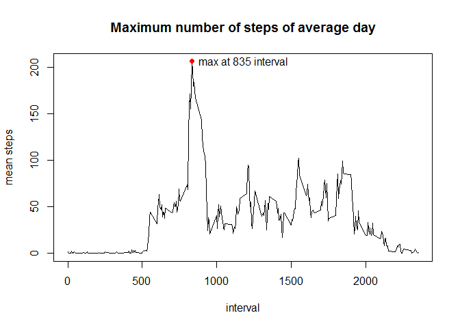
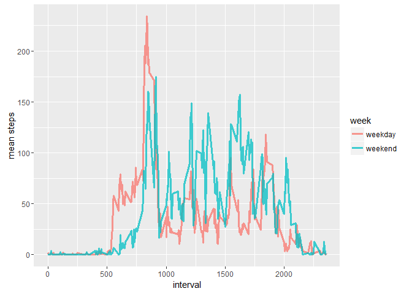

Intro
-----

This is my submission for the Reproducible Research class. It is ordered
by the nine tasks from the assignment.

1. Code for reading in the dataset and/or processing the data
-------------------------------------------------------------

First, loading my favorite libraries.

    library(data.table)
    library(ggplot2)

Reading table and making a `data.table`.

    fdir <- "C:/Users/matznerni/Documents/R/coursera/ProgAssig_Repro1/"
    readdata <- read.csv(paste0(fdir, "activity.csv"), colClasses = c("numeric", "Date", "numeric"))
    dtna <- as.data.table(readdata)

Now, two data.tables are created for later use. One with NAs (`dtna`)
and the other (`dt`) without NA values.

    dt <- dtna[!is.na(dtna$steps), ] 

2. Histogram of the total number of steps taken each day
--------------------------------------------------------

The following code sums up the steps by colomn *date* using the
`data.table` package.

    dt.steps <- dt[, sum(steps), by = date]
    dt.steps <- dt.steps[, .(V1, date)]
    names(dt.steps)[1] <- "daysteps"
    hist(dt.steps$daysteps, main = "Total number of steps taken each day", xlab = "Steps per day")

3. Mean and median number of steps taken each day
-------------------------------------------------

    stepsmean <- mean(dt.steps$daysteps, na.rm = TRUE)
    stepsmedian <- median(dt.steps$daysteps, na.rm = TRUE)
    cat(paste0("Mean of steps   ",stepsmean, "\n", "Median of steps ", stepsmedian))

    ## Mean of steps   10766.1886792453
    ## Median of steps 10765

4. Time series plot of the average number of steps taken
--------------------------------------------------------

Now, we make a time series of the mean steps which will also be used in
the next section.

    dt.int <- dt[, mean(steps), by = interval]
    names(dt.int)[2] <- "mean steps"
    plot(dt.int, type = "l", main = "Maximum number of steps of average day")

5. The 5-minute interval that, on average, contains the maximum number of steps
-------------------------------------------------------------------------------

Here we add a point and text to indicate the interval that contains the
abolute maximum of steps.

    ypos <- max(dt.int$`mean steps`)
    xpos <- dt.int[dt.int$`mean steps` == ypos]$interval
    plot(dt.int, type = "l", main = "Maximum number of steps of average day")
    points(xpos, ypos, pch = 16, col = "Red")
    text(xpos, ypos, paste0("max at ", xpos, " interval"), pos = 4)

6. Code to describe and show a strategy for imputing missing data
-----------------------------------------------------------------

No. of NA values in columns of the data.table.

    colSums(is.na(dtna))

    ##    steps     date interval 
    ##     2304        0        0

The following lines will create and fill a data.table with mean values.
NAs will be replaced with means.

    dtfill <- dtna
    dtfill[is.na(dtfill$steps), ]$steps <- dt.int$`mean steps`

7. Histogram of the total number of steps taken each day after missing values are imputed
-----------------------------------------------------------------------------------------

The same operations as under no. 2 are reproduced with data including NA
values.

    dtfill.steps <- dtfill[, sum(steps), by = date]
    dtfill.steps <- dtfill.steps[, .(V1, date)]
    names(dtfill.steps)[1] <- "daysteps"
    hist(dtfill.steps$daysteps, main = "Total number of steps taken each day (incl. missing values)", xlab = "Steps per day")

The data filled with NA values is used to calculate mean and median
again. Means and medians of normal and filled data are compared.

    stepsmean.fill <- mean(dtfill.steps$daysteps, trim = 1)
    stepsmedian.fill <- median(dtfill.steps$daysteps)
    cat(paste0("Mean of steps                    ",stepsmean, "\n", "Median of steps                  ", stepsmedian, "\n", "Mean of steps with filled data   ", stepsmean.fill, "\n", "Median of steps with filled data ", stepsmedian.fill))

    ## Mean of steps                    10766.1886792453
    ## Median of steps                  10765
    ## Mean of steps with filled data   10766.1886792453
    ## Median of steps with filled data 10766.1886792453

8. Panel plot comparing the average number of steps taken per 5-minute interval across weekdays and weekends
------------------------------------------------------------------------------------------------------------

Weekdays are computated from dates. Then weekday/weekend split the data
and allow to caldulate two sets of mean steps. These are combined in one
plot (using `ggplot2`, which has been loaded above).

    Sys.setlocale("LC_TIME", "English") # In case sys-language is different

    ## [1] "English_United States.1252"

    dtweek <- dt[, weekd := as.factor(ifelse(weekdays(dt$date) %in% c("Saturday", "Sunday"), "weekend", "weekday"))]
    lweek <- split(dtweek[,.(steps, interval, weekd)], dtweek$weekd)
    lweek <- lapply(lweek, function(x){x[, mean(steps), by = interval]})
    dtweek <- rbind2(cbind(lweek[[1]], "weekday"), cbind(lweek[[2]], "weekend")) # This could have been more elegant
    colnames(dtweek) <- c("interval", "mean steps", "week")
    dtweek$week <- as.factor(dtweek$week)
    ggplot(dtweek, aes(interval, `mean steps`, color = week)) +
          geom_line(aes(group = week), size = 1.25, alpha = 0.75)

9. All of the R code needed to reproduce the results (numbers, plots, etc.) in the report
-----------------------------------------------------------------------------------------

The code and its results are visible above.

*Thanks for reviewing my assignment!*
